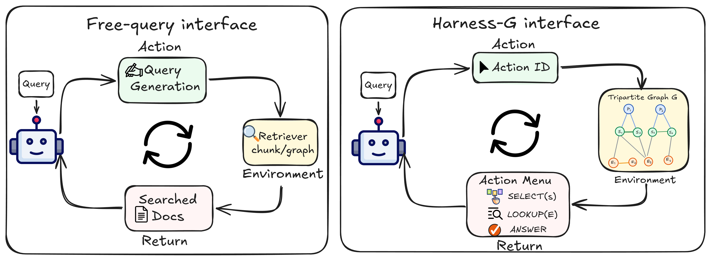
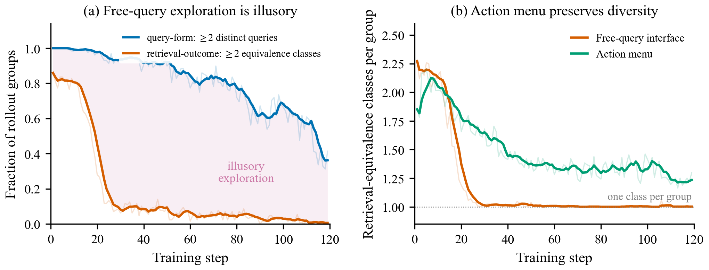
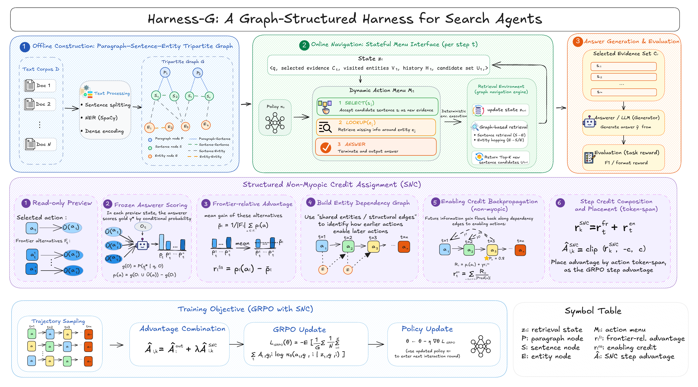

<h1 align="center">Harness-G</h1>

<p align="center">
  <strong>A Graph-Structured Harness for Search Agents</strong>
</p>

<p align="center">
  Official implementation of
  <a href="https://arxiv.org/abs/2607.27652"><em>Harness-G: A Graph-Structured Harness for Search Agents</em></a>
</p>

<p align="center">
  Yanning Hou<sup>*</sup>, Haoyuan Chen<sup>*</sup>, Sihang Zhou<sup>†</sup>,
  Xiaoshu Chen, Xirui Liu, Duanyang Yuan, Lingyuan Meng, Siwei Wang, Quan Liu, Jian Huang
  <br>
  National University of Defense Technology
  <br>
  <sup>*</sup>Equal contribution &nbsp;&nbsp; <sup>†</sup>Corresponding author
</p>

<p align="center">
  
  
  <a href="LICENSE"></a>
</p>

<p align="center">
  <a href="https://arxiv.org/abs/2607.27652">Paper</a> ·
  <a href="#overview">Overview</a> ·
  <a href="#method">Method</a> ·
  <a href="#results">Results</a> ·
  <a href="#quick-start">Quick Start</a> ·
  <a href="#citation">Citation</a>
</p>

<p align="center">
  
</p>

## Overview

Reinforcement-learning search agents typically generate free-form retrieval
queries. Although the strings may look diverse, they often retrieve nearly
identical evidence, leaving group-relative optimization with little meaningful
retrieval contrast. We refer to this failure mode as **retrieval-equivalence
collapse**.

Harness-G replaces free-form query generation with a finite menu of typed,
verifiable actions over a programmatically induced
paragraph–sentence–entity graph. The policy selects an action ID, while the
environment handles query construction, graph navigation, validation, and
deduplication.

<p align="center">
  
</p>

## Method

<p align="center">
  
</p>

Harness-G consists of three components:

1. **Graph construction:** build a paragraph–sentence–entity graph without a
   generative LLM.
2. **Structured navigation:** expose a bounded, state-dependent action menu
   instead of asking the policy to write retrieval queries.
3. **Structured Non-Myopic Credit (SNC):** compare feasible same-state
   alternatives and propagate downstream gains to enabling actions during
   GRPO training.

The frozen answerer and action previews are used only during training, so
Harness-G introduces no additional scorer calls at inference time. Core
implementations are available in
[`harness_g/snc.py`](harness_g/snc.py) and
[`harness_g/snc_trainer.py`](harness_g/snc_trainer.py).

## Results

Harness-G achieves the highest average F1 across six QA benchmarks at both
evaluated Qwen2.5 model scales.

| Backbone | Graph-R1 | Harness-G | Gain |
| --- | ---: | ---: | ---: |
| Qwen2.5-1.5B-Instruct | 40.09 | **50.83** | **+10.74** |
| Qwen2.5-3B-Instruct | 51.26 | **55.24** | **+3.98** |

With Qwen2.5-3B-Instruct, Harness-G improves over Graph-R1 by **+7.97 F1** on
2WikiMultiHopQA, **+9.12 F1** on HotpotQA, and **+5.95 F1** on MuSiQue.

## Installation

```bash
git clone https://github.com/7HHHHH/Harness-G.git
cd Harness-G

ENV_NAME=s3 PYTHON_VERSION=3.9 \
  bash scripts/setup_harness_g_conda.sh

conda activate s3
python -m pip install tiktoken
python -m spacy download en_core_web_sm
```

The reported experiments use Linux, Python 3.9, PyTorch 2.4, and NVIDIA GPUs.
If your CUDA version differs, install the corresponding PyTorch build first.

## Quick Start

Datasets are not redistributed in this repository. We use the six-dataset
release provided by [Graph-R1](https://github.com/LHRLAB/Graph-R1#dataset-preparation);
follow their dataset instructions to obtain the source corpora and QA splits.

Set up an external workspace for corpora, graphs, checkpoints, and run outputs:

```bash
export EXPERIMENT_ROOT=/absolute/path/to/harness_g_experiments
bash experiments/scripts/setup_workspace.sh
```

Prepare a 2WikiMultiHopQA corpus, construct the graph, and launch training:

```bash
python experiments/scripts/prepare_corpus.py \
  --source /absolute/path/to/2wiki_corpus.jsonl

bash experiments/scripts/build_graph.sh
bash experiments/scripts/launch_full_snc.sh
```

Launchers for HotpotQA, MuSiQue, NQ, PopQA, TriviaQA, and the 1.5B model are
included under [`experiments/`](experiments/). See the
[experiment guide](experiments/README.md) for dataset preparation
and additional commands.

Evaluation utilities for Exact Match, token-overlap F1, retrieval similarity,
and generation quality are provided in [`evaluation/`](evaluation/).

## Citation

If you find Harness-G useful, please cite:

```bibtex
@misc{hou2026harnessg,
  title         = {Harness-G: A Graph-Structured Harness for Search Agents},
  author        = {Yanning Hou and Haoyuan Chen and Sihang Zhou and Xiaoshu Chen
                   and Xirui Liu and Duanyang Yuan and Lingyuan Meng and Siwei Wang
                   and Quan Liu and Jian Huang},
  year          = {2026},
  eprint        = {2607.27652},
  archivePrefix = {arXiv},
  primaryClass  = {cs.CL},
  url           = {https://arxiv.org/abs/2607.27652}
}
```

## Acknowledgements

This project builds on
[Graph-R1](https://github.com/LHRLAB/Graph-R1) and
[VERL](https://github.com/volcengine/verl). We thank their authors and
contributors for making their work publicly available.

## License

This project is released under the [MIT License](LICENSE).
